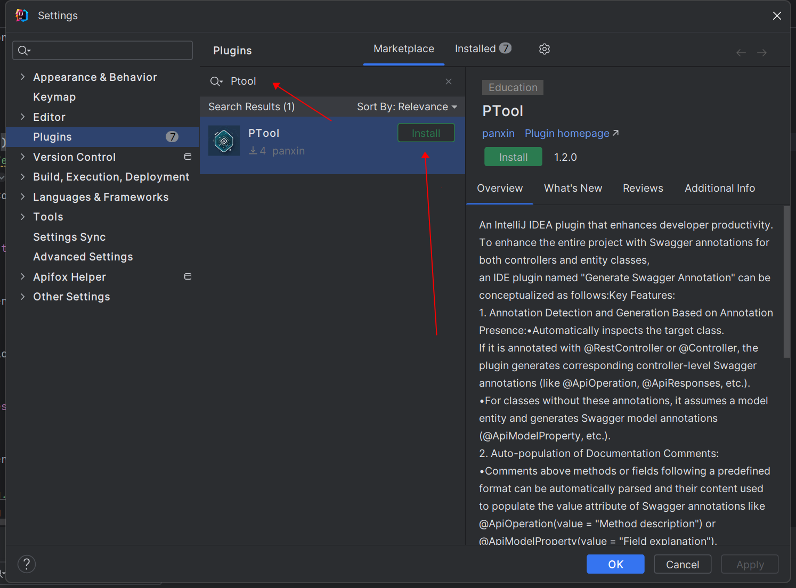
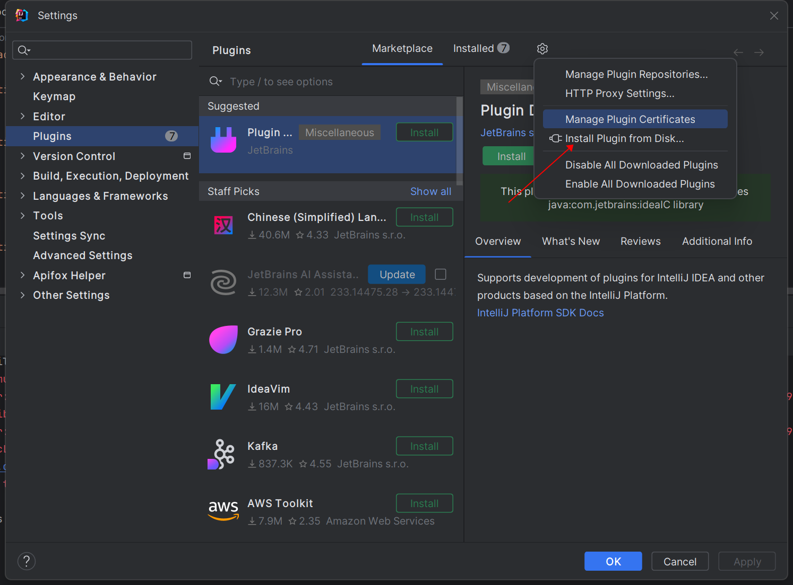

# PTool

[开发文档](./doc/README_DEV.md)

## 注意
所有功能需要在idea建立索引以后,可以使用前菜单会置灰或者隐藏


## 安装

### 方法一
在插件市场搜索PTool


### 方法二
在release中下载zip文件，本地安装


## 1. swagger-annotation-generator
可以为整个项目的controller和实体类增添swagger注解
IDEA Plugin -Generate swagger annotation

* 如果目标类上有@RestController或@Controller注解,则生成对应controller swagger注解，否则生成model swagger注解。
* 可通过选中类名、字段名、方法名生成指定swagger注解。
* 以下注释格式可自动填充到注解value中。
```
    /**
     * test
     * @desc test
     * @describe test
     * @description test
     */
    @ApiModelProperty("test test test test")
    private String test1;

    // test
    @ApiModelProperty("test")
    private String test2;

    @ApiModelProperty("")
    private String test3;
```
### 使用方法
1. 单个类，右键generate-SwaggerAnnotation
2. 批量生成，菜单栏-tool-PTool